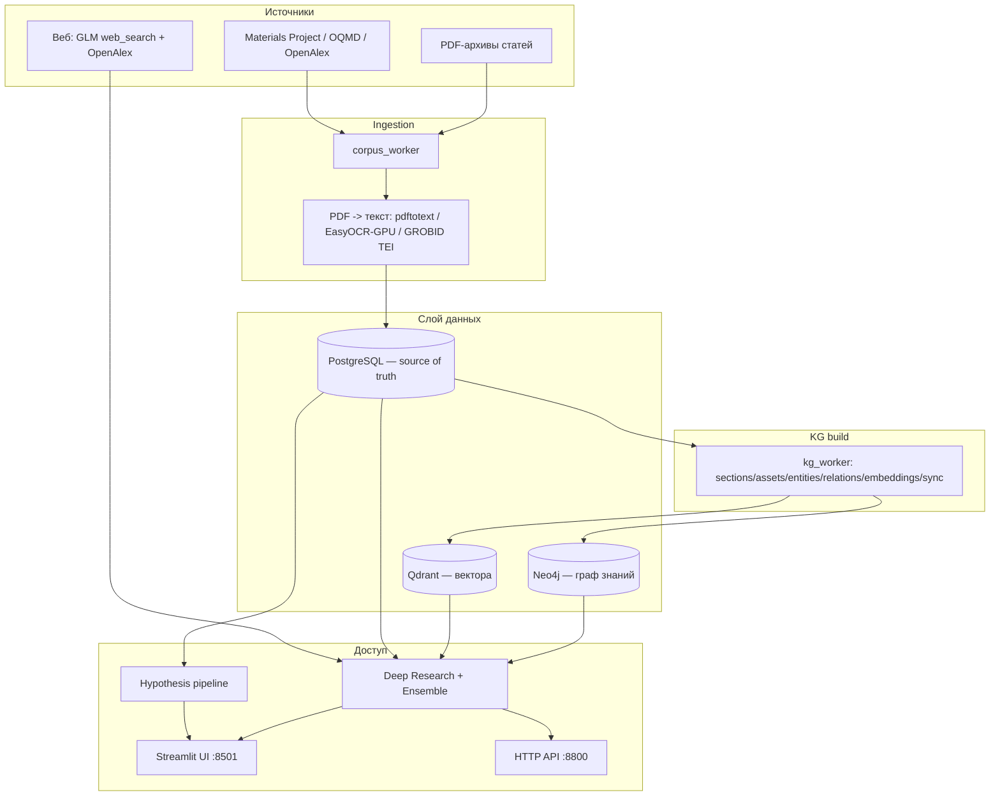
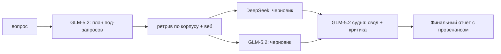

# nn_hypogen
=======
# Hypothesis Factory — Deep Research по обогащению руды

Интерпретируемая R&D-платформа для задачи Норникеля: **снизить потери Ni/Cu в отвальных хвостах флотации**. Система превращает разрозненный научный корпус (PDF-статьи, металлургические БД, веб) в проверяемые, подкреплённые источниками ответы и гипотезы.

Ядро — два продукта поверх одного слоя данных:

1. **Deep Research** — DeepSearch-стиль: вопрос → декомпозиция → мультиретрив по корпусу (Qdrant + граф знаний) → веб-аугментация → синтез ответа с инлайн-цитатами `[n]`. Есть ансамблевый режим (DeepSeek + GLM-5.2 с GLM-судьёй).
2. **Hypothesis Factory** — генерация evidence-backed R&D-гипотез под KPI со скорингом и провенансом.

Доступ: Streamlit-сайт, HTTP API (stdlib, без зависимостей), CLI-воркеры.

---

## Оглавление

- [Зачем это и почему так](#зачем-это-и-почему-так)
- [Архитектура](#архитектура)
- [Слой данных: почему Postgres — source of truth](#слой-данных-почему-postgres--source-of-truth)
- [Пайплайн обработки](#пайплайн-обработки)
- [Deep Research: как устроен](#deep-research-как-устроен)
- [Веб-аугментация](#веб-аугментация)
- [HTTP API](#http-api)
- [Streamlit UI](#streamlit-ui)
- [Быстрый старт](#быстрый-старт)
- [Внешний доступ (публичные ссылки)](#внешний-доступ-публичные-ссылки)
- [Конфигурация (.env)](#конфигурация-env)
- [Структура репозитория](#структура-репозитория)
- [Ограничения и дизайн-решения](#ограничения-и-дизайн-решения)

---

## Зачем это и почему так

**Проблема.** В хвостах флотации Ni/Cu теряется ценный металл. Ответы на «как снизить потери» рассеяны по тысячам статей (флотация, измельчение, классификация, гидроциклоны, реагентные режимы), металлургическим БД и патентам. Ручной обзор не масштабируется, а «голый» LLM галлюцинирует и не даёт провенанса.

**Решение и принципы:**

- **Провенанс важнее «красивого ответа».** Каждое фактическое утверждение привязано к пронумерованному источнику `[n]` — внутреннему (наш корпус) или внешнему (`[web]`/`[openalex]` с URL). Нельзя проверить — нельзя использовать в R&D.
- **Никогда не hard-fail.** Каждый слой имеет деградацию: нет Neo4j/Qdrant → поиск падает обратно на Postgres; нет LLM-ключа → экстрактивный ответ; нет GPU → CPU-OCR. Система всегда возвращает результат с пометкой degraded/skipped.
- **Разделение source-of-truth и индексов.** Postgres — единственный ledger; Neo4j и Qdrant пересобираемы из него. Потеря индекса ≠ потеря данных.
- **Ансамбль вместо одной модели.** Разные LLM ошибаются по-разному. Две независимые модели-черновика + судья снижают дисперсию и ловят пропуски.
- **Веб как дополнение, не замена.** Если в корпусе пробел — добираем свежие источники из интернета, но помечаем их отдельно, чтобы не смешивать доверенный корпус и открытый веб.

---

## Архитектура



**Сервисы (docker-compose):**

| Сервис | Образ | Роль | Порт (host) |
|---|---|---|---|
| `postgres` | postgres:16-alpine | ledger/провенанс, source of truth | 55432 |
| `neo4j` | neo4j:5-community (+GDS) | граф сущностей/связей | 57474 / 57687 |
| `qdrant` | qdrant/qdrant:v1.12.6 | вектор-индекс чанков | 56333 / 56334 |
| `grobid` | lfoppiano/grobid:0.8.0 | TEI-парсинг научных PDF | 58070 |
| `hypothesis-factory` | build ./hypothesis-factory | код: воркеры, API, UI | 58501 (UI) |

`hypothesis-factory` монтирует `backend/` и `app/` как volumes — код правится без пересборки образа. API (8800) слушает внутри docker-сети и пробрасывается наружу туннелем.

---

## Слой данных: почему Postgres — source of truth

PostgreSQL хранит полный провенанс, из которого можно пересобрать любой индекс:

- **Ingestion:** `ingest_runs`, `ingest_jobs`, `source_files`, `document_texts`, `document_chunks`, `structured_records`, `artifacts`, `llm_calls`
- **Materials KG:** `document_sections`, `document_assets`, `kg_entities`, `kg_entity_aliases`, `kg_relations`, `kg_embeddings`, `kg_sync_status`

Neo4j и Qdrant — **derived indexes**. `kg_sync_status` фиксирует, что и когда синкнуто (идемпотентно; повторный sync апсертит, а не дублирует). Параллельная обработка воркеров — через `FOR UPDATE SKIP LOCKED` на `ingest_jobs` (очередь без гонок).

---

## Пайплайн обработки

```
raw files / APIs
  -> corpus ingestion (corpus_worker)        # регистрация файлов, дедуп, очередь джобов
  -> PDF -> текст                            # pdftotext -layout; fallback EasyOCR(GPU)/Tesseract; GROBID TEI
  -> chunking (1800/250 симв.)               # document_chunks
  -> Materials KG (kg_worker)                # sections/assets -> entities -> relations -> embeddings
  -> sync                                    # Neo4j (граф) + Qdrant (вектора)
  -> Deep Research / Hypotheses / UI / API
```

**Почему EasyOCR на GPU:** Tesseract на CPU был узким местом на большом корпусе. EasyOCR c CUDA (PyTorch) даёт кратное ускорение; включается `HF_OCR_ENGINE=easyocr`, `HF_OCR_GPU=1`, проброс GPU через `NVIDIA_VISIBLE_DEVICES=all`. Без GPU — автоматический откат на Tesseract.

**Почему GROBID:** для научных PDF нужен структурный разбор (секции, таблицы, формулы, библиография) в TEI — эвристики по «плоскому» тексту теряют структуру. GROBID CPU-bound, поэтому в KG-пайплайне embeddings+Qdrant приоритезируются раньше тяжёлого `sections,assets`, чтобы поиск поднимался быстрее.

**Эмбеддинги:** сейчас `local-hashing-384` (детерминированный TF-IDF-подобный, CPU, без внешних зависимостей и ключей). Компромисс скорость/автономность vs качество; апгрейд на нейросетевые эмбеддинги — в планах (см. ограничения).

---

## Deep Research: как устроен

Файл: `backend/services/deep_research.py`.

**Одиночный режим (`run_deep_research`):**

```
вопрос
  -> LLM-декомпозиция на 2-4 под-запроса (строгий JSON)
  -> мультиретрив: по каждому под-запросу top-k из Qdrant/KG (mode: qdrant|auto|kg|tfidf)
  -> пул evidence с нумерацией источников (+ веб-источники, если web=true)
  -> LLM-синтез ответа с инлайн-цитатами [n]
  -> fallback: экстрактивный ответ, если LLM недоступен (никогда не падает)
```

**Ансамблевый режим (`run_deep_research_ensemble`)** — почему так:



- **GLM-5.2 — планировщик и судья.** У GLM сильный `reasoning_effort=high`/thinking-режим — хорош для декомпозиции и критической сборки.
- **DeepSeek + GLM пишут черновики параллельно** (`ThreadPoolExecutor`) на одном и том же пуле источников — независимые точки зрения.
- **Судья сводит** черновики в финал, отсекая противоречия и дыры. Reasoning судьи виден в UI.

Единый пул источников гарантирует, что все модели цитируют одну и ту же нумерацию `[n]` — цитаты сопоставимы между черновиками и финалом.

---

## Веб-аугментация

Файл: `backend/services/web_search.py`. Включается флагом `web=true` (по умолчанию on).

Два бэкенда, вызываются параллельно, результаты дедуплицируются и вливаются в общий пул evidence с зарезервированными местами:

- **`glm`** — нативный веб-поиск Zhipu через отдельный эндпоинт `/web_search`, движок `search_prime` (проверено эмпирически: chat/completions-инструмент отдавал симуляцию, отдельный эндпоинт — реальные структурированные результаты). Свежие общие/инженерные источники.
- **`openalex`** — научная литература с фильтром по году (`HF_OPENALEX_YEAR_FROM`). Пиры, DOI, метаданные.

Веб-источники помечаются `source_type=web|openalex`, URL кладётся как `filename` → в цитатах становится кликабельным. Промпты синтеза и судьи явно требуют разделять «наш корпус» и «интернет».

---

## HTTP API

Zero-dependency `ThreadingHTTPServer` (stdlib) — переживает пересборку образа через смонтированный код. Запуск: `python -m backend.api_server --host 0.0.0.0 --port 8800`.

| Метод | Путь | Назначение |
|---|---|---|
| GET | `/health` | статус + провайдеры LLM + веб-бэкенды |
| GET | `/runs` | доступные корпуса (с флагом qdrant_ready) |
| POST | `/research` | одиночный Deep Research |
| POST | `/research/ensemble` | ансамбль DeepSeek + GLM |

**Тело POST:** `{question, run_id?, mode?, top_k?, max_subqueries?, max_context?, web?, web_max?, web_backends?}`

**Auth:** если задан `HF_API_KEY` — заголовок `X-API-Key: <key>` или `Authorization: Bearer <key>` (`/health` всегда открыт). CORS разрешён.

```bash
curl -s http://<host>:8800/research/ensemble \
  -H "X-API-Key: $KEY" -H "Content-Type: application/json" \
  -d '{"question":"Как снизить потери никеля в отвальных хвостах флотации?","web":true}'
```

Ответ: `{question, answer, sub_queries, steps, citations[], warnings, ...}`; в ансамбле — ещё `drafts[]`, `judge_reasoning`, `plan_provider`, `judge_provider`.

---

## Streamlit UI

Файл: `app/streamlit_app.py`. Три вкладки:

- **Deep Research** — вопрос, выбор режима ретрива, ансамбль вкл/выкл, галка веб-поиска, рендер финала + черновиков + reasoning судьи + кликабельные цитаты с тегами `[web]/[openalex]/[корпус]`.
- **Hypotheses** — генерация гипотез под KPI (параметры/веса в сайдбаре).
- **Materials KG** — прямой поиск evidence и графовых хитов.

Наверху — свёрнутый блок «Как пользоваться (быстрый старт)».

---

## Быстрый старт

```bash
# 1. Поднять стек
docker compose up -d postgres neo4j qdrant grobid hypothesis-factory

# 2. Ingest папки в Postgres
docker compose exec hypothesis-factory python -m backend.corpus_worker ingest \
  --path "/workspace/Задача 1" --run-name zadacha1 --ocr auto --deepseek auto

# 3. Собрать KG (эмбеддинги + Qdrant приоритетно)
docker compose exec hypothesis-factory python -m backend.kg_worker build \
  --run-id latest --stages embeddings,sync,sections,assets,entities,relations

# 4. UI
docker compose exec -d hypothesis-factory streamlit run app/streamlit_app.py \
  --server.port 8501 --server.address 0.0.0.0 --server.headless true
#   -> http://localhost:58501

# 5. API
docker compose exec -d hypothesis-factory python -m backend.api_server --host 0.0.0.0 --port 8800

# Тесты
docker compose exec hypothesis-factory python -m unittest discover -s tests
```

Статусы: `corpus_worker status --run-id latest`, `kg_worker status --run-id latest`.

---

## Внешний доступ (публичные ссылки)

Наружу пробрасывается через `cloudflared` quick-туннели (эфемерные `*.trycloudflare.com`, адрес меняется при перезапуске):

```bash
# UI
cloudflared tunnel --no-autoupdate --url http://localhost:58501 > logs/cloudflared_ui.log 2>&1 &
# API (указывает на docker-IP контейнера, где слушает 8800)
cloudflared tunnel --no-autoupdate --url http://<container-ip>:8800 > logs/cloudflared_api.log 2>&1 &
grep -oE 'https://[a-z0-9-]+\.trycloudflare\.com' logs/cloudflared_*.log
```

Для стабильного адреса — именованный туннель Cloudflare со своим доменом или ngrok c фиксированным поддоменом.

> Публичные `trycloudflare`-ссылки временные и меняются при рестарте — актуальные спрашивай у владельца стенда.

---

## Конфигурация (.env)

Копируй `hypothesis-factory/.env.example` → `.env`. Ключевые переменные:

| Переменная | Смысл | Дефолт |
|---|---|---|
| `HF_MOCK_LLM` | 1 = не звать реальные LLM | `1` |
| `DEEPSEEK_API_KEY` / `DEEPSEEK_MODEL_*` | DeepSeek для черновиков | — / `deepseek-v4-pro`,`-flash` |
| `GLM_API_KEY`/`ZAI_API_KEY`, `GLM_MODEL`, `GLM_REASONING_EFFORT` | GLM-5.2: план/судья/веб | `glm-5.2`, `high` |
| `HF_WEB_SEARCH`, `HF_WEB_SEARCH_BACKENDS`, `GLM_WEB_SEARCH_ENGINE` | веб-аугментация | `1`, `glm,openalex`, `search_prime` |
| `HF_API_KEY` | ключ доступа к HTTP API | пусто = открыто |
| `HF_OCR_ENGINE`, `HF_OCR_GPU` | движок OCR и GPU | `easyocr`/`tesseract`, `1` |
| `CORPUS_DATABASE_URL` | Postgres DSN (иначе SQLite) | из compose |
| `NEO4J_URI/USER/PASSWORD`, `QDRANT_URL`, `GROBID_URL` | derived-индексы | из compose |
| `HF_KG_EMBEDDING_MODEL/DIMENSIONS` | эмбеддер | `local-hashing-384` / `384` |

Реальный `.env` и `.rag_api_key` **не коммитятся** (в `.gitignore`).

---

## Структура репозитория

```
hackNOR/
├─ docker-compose.yml            # весь стек
├─ hypothesis-factory/
│  ├─ backend/
│  │  ├─ api_server.py           # HTTP API (stdlib)
│  │  ├─ corpus_worker.py        # ingestion CLI
│  │  ├─ kg_worker.py            # KG build/search CLI
│  │  ├─ main.py, schemas.py, config.py
│  │  └─ services/               # deep_research, web_search, llm, retrieval,
│  │     │                       #   materials_kg, knowledge_graph, embeddings,
│  │     │                       #   pdf_* , entity/relation_extraction, scoring, ...
│  ├─ app/streamlit_app.py       # UI
│  ├─ scripts/                   # экспортеры источников, бенчмарки, демо
│  ├─ tests/                     # unittest
│  ├─ docs/                      # детальная документация по подсистемам
│  └─ .env.example
└─ README.md                     # этот файл
```

Детали по подсистемам — в `hypothesis-factory/docs/` (architecture, corpus, pdf-processing, materials-kg, docker, pipeline-ui, operations).

---

## Ограничения и дизайн-решения

- **Эмбеддинги — hashing/TF-IDF, не нейросетевые.** Осознанный компромисс (автономность/скорость, без ключей). Апгрейд на нейроэмбеддинги — приоритетный next step для качества ретрива.
- **Neo4j/Qdrant/GROBID опциональны.** Недоступны → degraded/skipped, Postgres не портится, поиск падает на Postgres-fallback.
- **LLM опциональны.** Без ключей — экстрактивные ответы; веб-бэкенд `glm` требует GLM-ключ, `openalex` работает без ключа.
- **KG-экстракция v1** — rule-based + опциональный LLM, не полноценная MatKG-онтология.
- **trycloudflare-ссылки эфемерны** — для прод-доступа нужен именованный туннель/домен.
- **Sci-Hub не интегрирован** и не используется как источник.